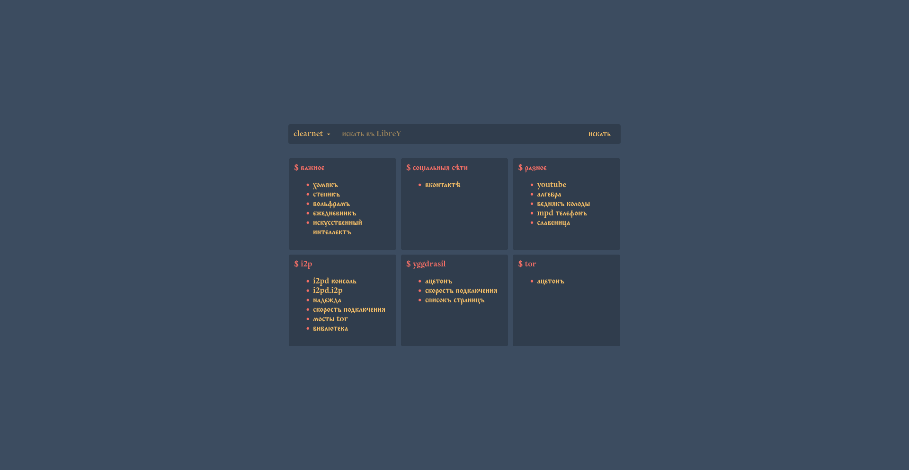

# Homepage
A homepage .html files collection forked from [pa5sarinho/homepage](https://github.com/pa5sarinho/homepage). My own file (homepage_mrgreen) was created for using alongside Otto KDE theme. I also changed search engine to [LibreY](https://github.com/Ahwxorg/librey/) [@codedipper](https://github.com/codedipper)'s instances in clearnet, i2p and tor with mode switcher. Clock was removed. Pointer type for search form changed to 'text'. Submit button is now underlined at hover. Of course, custom favorites were added. Russian pre-revolutionary language is used. 

There is also a 'homepage_mrgreen_gentoo' variant that is currently outdated because I've broken my installation.

Anyone can access any homepage variant stored in this repository by adding variant filename to https://somereatardedwood.github.io/homepage/ link, i.e. https://somereatardedwood.github.io/homepage/homepage_mrgreen.html.

Since I am not a developer at all, I used ChatGPT to understand html and then write some parts for me. Most of the time there are comments besides ChatGPT's lines. 

I also created a PAC script that I use in [IceCat](https://icecatbrowser.org/index.html) on my laptop and [Cromite](https://github.com/uazo/cromite) on my android device. Script is optimized for usage of i2pd default socks proxy for i2p websites, tor default socks proxy for tor websites, no proxy for yggdrasil websites, [byedpi](https://github.com/hufrea/byedpi) socks proxy for websites blocked in Russian Federation (though byedpi currently doesn't work on my laptop), and [acetone's yggdrasil socks proxy](https://yggdrasil-network.github.io/services.html) for websites that are blocked for users in Russian Federation.

## Otto

Font in the screenshot is 'Monomakh Unicode'.

## Homepage deployment guide for dummies/noncoders/nondevs as myself

1. Fork original repo/fork this repo/write your own html??
2. Change the code to your desires (i.e., change favorites list or colours). If you don't understand something — ~~google~~ librey, rtfm or use AIs
3. Push changes to your fork
4. On github website in your repo go to Settings->Pages, use 'Deploy static content to Pages' workflow
5. Go to https://username.github.io/reponame/filename, i.e. https://somereatardedwood.github.io/homepage/homepage_mrgreen.html